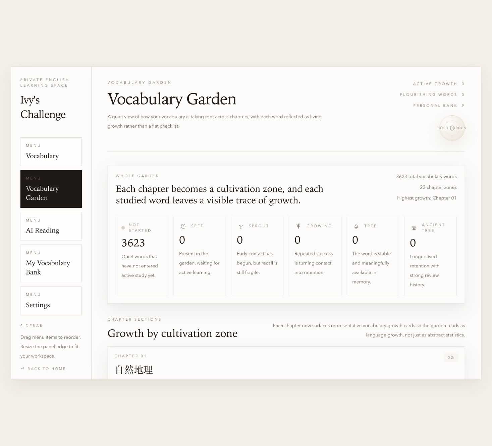
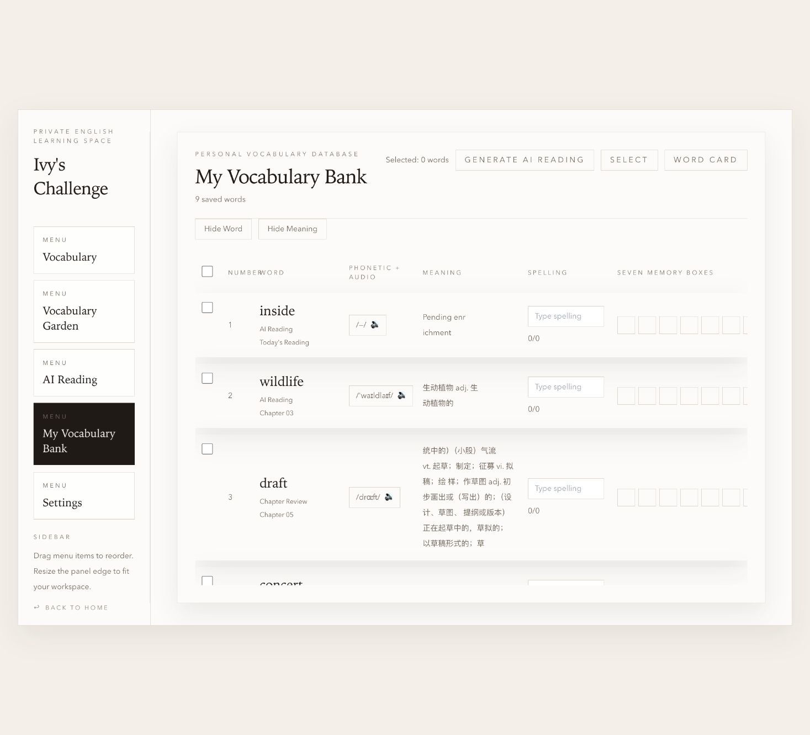
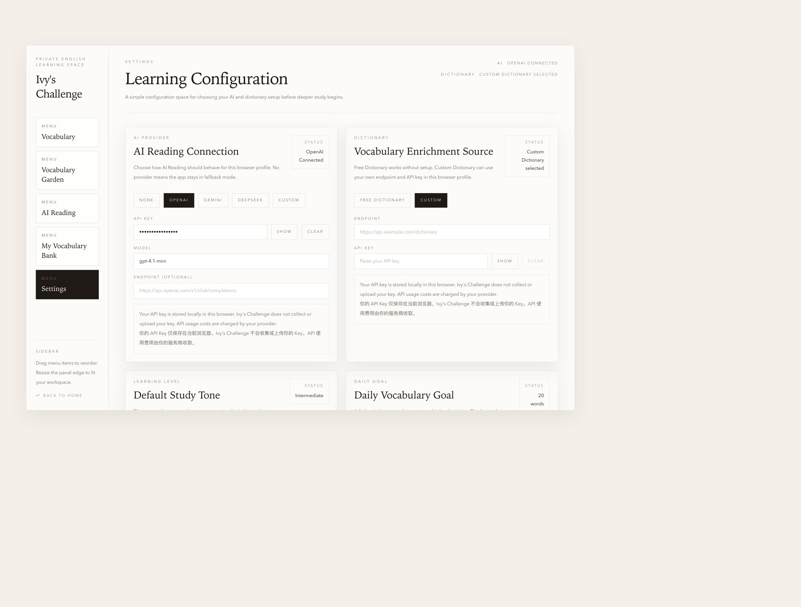

# Ivy's Challenge

## Overview

Ivy's Challenge is a private English learning space designed around long-term vocabulary growth rather than short-cycle memorization.

The project focuses on four ideas:

- Vocabulary
- Memory
- Growth
- Personal Learning Space

It is not a traditional drill-heavy vocabulary tool. Instead, it combines structured vocabulary review, personal word capture, reading-based discovery, and visual progress systems into a calm browser-based learning environment.

## Features

- Vocabulary Library
- Word Card Mode
- Word List Mode
- Personal Vocabulary Bank
- Vocabulary Garden
- AI Reading
- Vocabulary Enrichment
- Memory System

## Tech Stack

- React
- TypeScript
- Vite
- Tailwind CSS

## Installation

```bash
git clone <your-fork-or-repo-url>
cd ivys-challenge
npm install
npm run dev
```

The development server starts locally through Vite. By default, the app is available at `http://localhost:5173`.

## Configuration

Copy the environment template and fill in only the providers you plan to use:

```bash
cp .env.example .env
```

Available configuration groups:

- AI Provider
- Dictionary Provider

Supported AI providers:

- OpenAI
- Gemini
- DeepSeek
- OpenAI-compatible providers

You must provide your own API key when using external AI or custom dictionary services. This project follows a browser-side BYOK (Bring Your Own Key) model and does not ship shared credentials.

Relevant variables are documented in `.env.example`:

- `VITE_AI_PROVIDER`
- `VITE_AI_MODEL`
- `VITE_AI_ENDPOINT`
- `VITE_AI_API_KEY`
- `VITE_DICTIONARY_PROVIDER`
- `VITE_DICTIONARY_ENDPOINT`
- `VITE_DICTIONARY_API_KEY`

## Supported AI Providers

Ivy's Challenge currently supports:

- OpenAI
- Gemini
- DeepSeek
- OpenAI-compatible providers

Users provide their own API keys, models, and endpoints when required.

## Data Storage

Learning data is stored locally in the user's browser by default.

This includes:

- vocabulary progress
- personal vocabulary
- memory status
- learning settings

The application does not upload learning progress to a project-managed backend service.

## External Services

Ivy's Challenge can optionally integrate with external services for:

- AI Provider
- Dictionary API
- Browser TTS

The project does not provide shared API quota, hosted AI access, or bundled third-party service credits. Users are responsible for configuring and operating their own provider accounts and API keys.

## API Key Security

- Ivy's Challenge does not provide shared API keys.
- Users provide their own keys under a browser-side BYOK model.
- Keys are stored locally in browser storage for the current browser profile.
- Ivy's Challenge does not collect or upload user API keys to a project-managed server.
- Users are responsible for their own AI provider or dictionary provider account, quota, and billing.

## Documentation

- [Architecture Guide](docs/ARCHITECTURE.md)
- [User Guide](docs/USER_GUIDE.md)
- [Release Checklist](docs/RELEASE_CHECKLIST.md)

## Live Demo

- GitHub Pages: [https://ivyyyyyy-tang.github.io/ivys-challenge/](https://ivyyyyyy-tang.github.io/ivys-challenge/)

## Screenshots

### Landing Page


### Vocabulary Garden



### AI Reading


### My Vocabulary Bank



### Settings



## Demo


The repository currently keeps a lightweight `docs/demo.gif` placeholder plus the full captured step frames in `docs/images/demo-frames/`.

If you want to regenerate the demo later, capture the flow in this order:

1. Open the site
2. Enter Vocabulary
3. Add a word to My Vocabulary Bank
4. Open Vocabulary Garden
5. Use AI Reading

This repository keeps the demo asset path at `docs/demo.gif`.

## Feedback

- GitHub Issues: [https://github.com/Ivyyyyyy-tang/ivys-challenge/issues](https://github.com/Ivyyyyyy-tang/ivys-challenge/issues)

## Development

Common development commands:

```bash
npm run build
node --test
```

`npm run build` verifies TypeScript and produces a production build.

The current repository test workflow uses Node's built-in test runner. If you prefer an alias such as `npm run test`, you can add it in your own fork without changing application behavior.

## License

This project is intended for a non-commercial license.

If you publish or distribute the repository, add a matching `LICENSE` file so the repository license and the README stay aligned.

## Contribution

Contributions are welcome, especially:

- bug reports
- feature suggestions
- pull requests

Please keep changes focused, documented, and easy to review.
